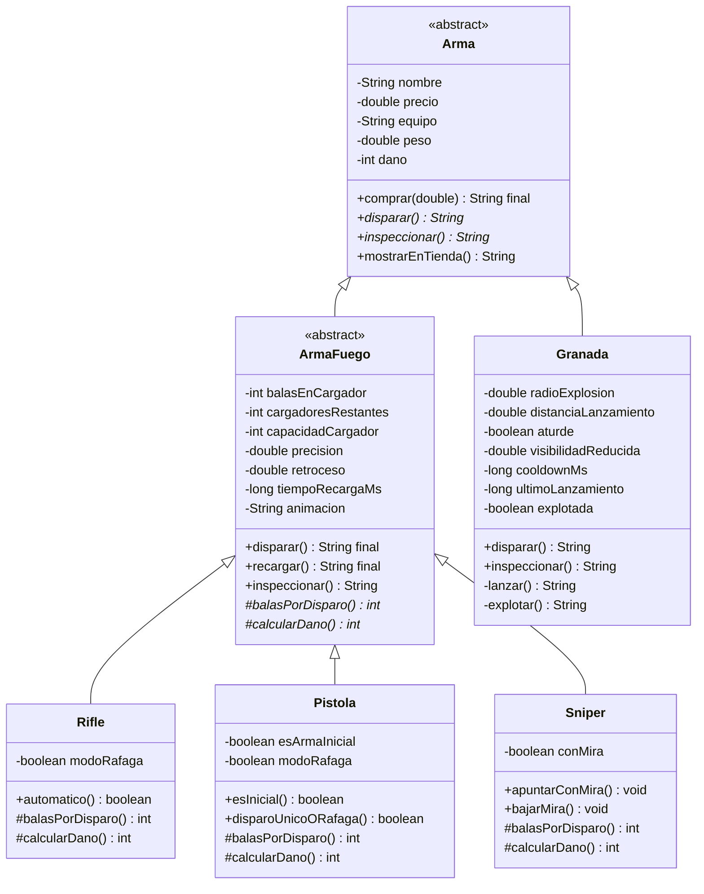

# MK-taller-git-2026 — Modelado de armas de CS2 con Spring Boot

Taller de Git de la facultad: hay que publicar un servicio HTTP propio en
Spring Boot que versione un modelado de clases con herencia,
sobreescritura y ocultamiento de información. Elegí la opción B
(Counter-Strike 2).

## Cómo correrlo

```bash
./mvnw spring-boot:run
```

Queda escuchando en `http://localhost:8080`.

## Qué endpoints tiene

- `GET /` — nada especial, solo confirma que el servicio está arriba.
- `GET /armas/crear?tipo=...` — arma una instancia de arma según el `tipo`
  que le pases (`rifle`, `pistola`, `sniper` o `granada`) y el resto de
  parámetros que quieras pisarle por query string (`nombre`, `precio`,
  `dano`, `modoRafaga`, `aturde`, etc. — si no los mandás, usa unos
  defaults razonables). Devuelve un JSON con lo que hace esa arma en
  particular: cómo se ve en la tienda, qué pasa si la comprás, qué pasa si
  disparás, y su animación de inspección.

Ejemplos que probé:

```bash
curl "http://localhost:8080/armas/crear?tipo=rifle&nombre=AK-47&modoRafaga=true"
curl "http://localhost:8080/armas/crear?tipo=sniper&nombre=AWP&dano=115"
curl "http://localhost:8080/armas/crear?tipo=granada&nombre=Flashbang&aturde=true"
```

## El modelo

Partí de la jerarquía que veníamos usando en POO-03 (Arma → ArmaFuego /
Granada → Rifle / Pistola / Sniper) y la tuve que endurecer para que
cumpla lo que pedía la consigna:



## Por qué lo armé así

La consigna pedía que el inventario pueda tratar cualquier arma igual
(pedirle que dispare, que recargue, que se muestre en la tienda) sin
fijarse de qué tipo es. Por eso `disparar()` está declarado como abstracto
directamente en `Arma`, no en `ArmaFuego` — así una `Granada` también
responde a `disparar()` aunque por dentro lo que hace es lanzarse y
explotar (delega en un `lanzar()` privado). Desde afuera no se nota la
diferencia.

Lo que sí me costó pensar fue cómo evitar que `Rifle`, `Pistola` y `Sniper`
terminaran repitiendo el mismo `disparar()` tres veces con pequeños
cambios. Terminé poniendo `disparar()` y `recargar()` como `final` en
`ArmaFuego` — se escriben una sola vez ahí — y cada subclase solo
sobreescribe dos métodos chiquitos: `balasPorDisparo()` (cuántas balas
gasta un tiro) y `calcularDano()` (cómo calcula el daño). Rifle y Pistola
en modo ráfaga gastan 3 balas por vez, Sniper siempre gasta 1 pero calcula
el daño distinto según si tenés la mira puesta o no.

Un cambio que hice sobre la marcha: al principio solo Rifle tenía lo de
ráfaga/automático. Pero pensándolo, una pistola tipo CZ75 también puede
disparar en ráfaga, así que le agregué el mismo campo `modoRafaga` a
`Pistola` y reutilicé el mismo método gancho en vez de inventar uno nuevo
— si no, iba a terminar duplicando lógica entre las dos.

Todo lo que tiene que ver con munición (`balasEnCargador`,
`cargadoresRestantes`) y con el cooldown de la granada
(`ultimoLanzamiento`, `cooldownMs`) lo dejé `private`. La idea es que nadie
de afuera pueda, por ejemplo, resetear el cooldown para hacer explotar una
granada antes de tiempo, ni cargar balas de la nada sin pasar por
`recargar()`.

Una cosa que agregué y que no estaba en el diagrama original de POO-03:
el atributo `nombre` en `Arma`. Lo necesitaba porque si no, `comprar()`,
`inspeccionar()` y el JSON que devuelve el controller no tienen forma de
decir de qué arma están hablando.

`mostrarEnTienda()` lo dejé como método normal (no abstracto) en `Arma`,
porque con nombre, precio, equipo y peso alcanza para mostrarla en la
tienda — no hacía falta que cada subclase lo reescriba.

## El controller

`ArmaController` recibe `tipo` por query param y ahí sí tiene que usar un
switch para saber qué constructor llamar (eso no se puede evitar, construir
el objeto correcto requiere saber el tipo). Pero una vez que la instancia
ya existe, todo el resto del método la trata como `Arma` — llama
`.mostrarEnTienda()`, `.comprar()`, `.disparar()`, `.inspeccionar()` sin
ningún `if` ni `instanceof` de por medio.

## Repo

https://github.com/Pomona06/MK-taller-git-2026
