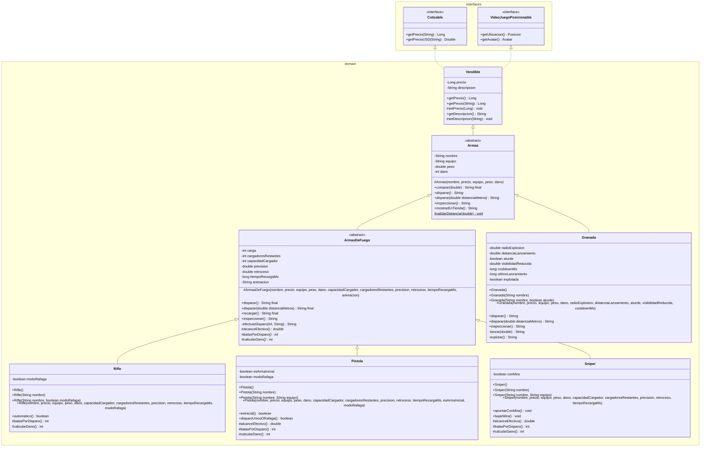

# MK-taller-git-2026 — Modelado de armas de CS2 con Spring Boot (Marcelo Kropff Y43819)

Ejercicio POO-06 (revisión, paquetes, constructores y sobrecarga) de Lenguaje de Programación 3.
Servicio HTTP propio en Spring Boot sobre el modelado de Counter-Strike 2 (opción B), con herencia,
sobreescritura, sobrecarga, ocultamiento de información y paquetes según el template de la cátedra.

- Enunciado: [ejercicio-poo-06-revision-paquetes-constructores-2026-09-30](https://github.com/alefq/afq-taller-git-2024/blob/main/docs/ejercicio-poo-06-revision-paquetes-constructores-2026-09-30.md)
- Bitácora de IA: [BITACORA.md](BITACORA.md)
- Especificaciones aplicadas a CS2 (objetivo, consignas y cómo probarlo): [docs/ESPECIFICACIONES.md](docs/ESPECIFICACIONES.md)
- Enlace al commit de la solución: (https://github.com/Pomona06/MK-taller-git-2026/commit/e7a1c2019b316689e0d4b630e5aee0edf2a06bf2)

## Licencia

Apache License 2.0. El texto completo está en [LICENSE](LICENSE).

## Cómo correr

Requiere Java 21.

```bash
./mvnw spring-boot:run
```

Queda escuchando en http://localhost:8080. Los tests se corren con `./mvnw test`.

## Endpoints

| Método y ruta | Qué hace |
|---|---|
| `GET /` | Confirma que el servicio está vivo y lista los endpoints. |
| `GET /armas/crear?tipo=...` | Construye el arma con el **constructor completo**. Todos los atributos se pueden pisar por query string (`nombre`, `precio`, `equipo`, `dano`, `modoRafaga`, `aturde`, etc.); si no mandás, usa unos defaults razonables. |
| `GET /armas/crear-simple?tipo=...` | Construye el arma con los **constructores sobrecargados**: sin argumentos, `(nombre)` o `(nombre, equipo / modoRafaga / aturde)` según lo que venga en la URL. El JSON dice qué firma se usó. |
| `GET /armas/comparar` | Arma una `List<Armas>` con un Rifle, una Pistola, un Sniper y una Granada y le pide a cada una `disparar()`. |

`tipo` puede ser `rifle`, `pistola`, `sniper` o `granada`. En los tres endpoints de armas, el parámetro
opcional `distancia` hace que se use la sobrecarga `disparar(double)` en lugar de `disparar()`.

Las respuestas de `crear` y `crear-simple` devuelven un JSON con: el tipo concreto, el constructor usado,
cómo se ve en la tienda, qué pasa si la comprás, qué mensaje de disparo se usó, qué pasa si disparás y la
animación de inspección.

Si un valor rompe una regla del dominio, la clase lo rechaza en el constructor y el servicio responde
**400** con el mensaje de la clase: `{"error": "..."}`.

### Ejemplos probados

```bash
curl "http://localhost:8080/"
curl "http://localhost:8080/armas/crear?tipo=rifle&nombre=AK-47&modoRafaga=true"
curl "http://localhost:8080/armas/crear?tipo=sniper&nombre=AWP&dano=115"
curl "http://localhost:8080/armas/crear-simple?tipo=sniper"
curl "http://localhost:8080/armas/crear-simple?tipo=granada&nombre=Flashbang&aturde=true"
curl "http://localhost:8080/armas/crear-simple?tipo=pistola&nombre=USP-S&equipo=CT&distancia=25"
curl "http://localhost:8080/armas/comparar"
curl "http://localhost:8080/armas/comparar?distancia=25"
curl "http://localhost:8080/armas/crear?tipo=rifle&dano=-5"      # 400: daño negativo
curl "http://localhost:8080/armas/crear?tipo=rifle&equipo=XYZ"   # 400: equipo inválido
```

Respuesta de `GET /armas/comparar` (el mismo mensaje, cuatro implementaciones distintas):

```json
[
  {"tipoConcreto":"Rifle","nombre":"AK-47","disparo":"AK-47 disparó (1 balas, precisión 0.75) causando 36 de daño. Quedan 29/30 balas."},
  {"tipoConcreto":"Pistola","nombre":"Glock-18","disparo":"Glock-18 disparó (1 balas, precisión 0.6) causando 30 de daño. Quedan 19/20 balas."},
  {"tipoConcreto":"Sniper","nombre":"AWP","disparo":"AWP disparó (1 balas, precisión 0.95) causando 46 de daño. Quedan 4/5 balas."},
  {"tipoConcreto":"Granada","nombre":"HE","disparo":"Lanzada a 20.0m. HE explotó (radio 5.0m, causa 57 de daño)"}
]
```

## Paquetes

La organización sigue el template [lp3-template-tp](https://github.com/alefq/lp3-template-tp/tree/main/src/main/java/py/edu/uc/lp3):

```
src/main/java/py/edu/uc/lp3/
├── Application.java              solo arranca Spring Boot
├── domain/                       reglas del juego
│   ├── Vendible.java
│   ├── Armas.java                (abstracta)
│   ├── ArmasDeFuego.java         (abstracta)
│   ├── Rifle.java · Pistola.java · Sniper.java
│   └── Granada.java
├── interfaces/                   Cotizable, VideoJuegoPosicionable, Avatar, Posicion
└── rest/controller/              entrada HTTP
    ├── IndexController.java      GET /
    ├── ArmaController.java       /armas/crear, /armas/crear-simple, /armas/comparar
    └── ManejadorErrores.java     IllegalArgumentException del dominio -> 400
```

El dominio no conoce nada de HTTP y los controllers no tienen reglas del juego: solo construyen, piden
mensajes al tipo padre y traducen el rechazo de una regla a un 400.

## El modelo

Acá cambió bastante respecto a la primera versión subida. Me di cuenta que el esqueleto real que veníamos usando del Zulip no era el que había armado yo, sino uno que ya venía con parte del código puesto. Rifle, Pistola, Sniper y Granada no estaban, eso le agregué yo.


```mermaid
classDiagram
    namespace interfaces {
        class Cotizable {
            <<interface>>
            +getPrecio(String) Long
            +getPrecioUSD(String) Double
        }
        class VideoJuegoPosicionable {
            <<interface>>
            +getUbicacion() Posicion
            +getAvatar() Avatar
        }
    }
    namespace domain {
        class Vendible {
            -Long precio
            -String descripcion
            +getPrecio() Long
            +getPrecio(String) Long
            #setPrecio(Long) void
            +getDescripcion() String
            #setDescripcion(String) void
        }
        class Armas {
            <<abstract>>
            -String nombre
            -String equipo
            -double peso
            -int dano
            #Armas(nombre, precio, equipo, peso, dano)
            +comprar(double) String final
            +disparar()* String
            +disparar(double distanciaMetros)* String
            +inspeccionar()* String
            +mostrarEnTienda() String
            #validarDistancia(double)$ void
        }
        class ArmasDeFuego {
            <<abstract>>
            -int carga
            -int cargadoresRestantes
            -int capacidadCargador
            -double precision
            -double retroceso
            -long tiempoRecargaMs
            -String animacion
            #ArmasDeFuego(nombre, precio, equipo, peso, dano, capacidadCargador, cargadoresRestantes, precision, retroceso, tiempoRecargaMs, animacion)
            +disparar() String final
            +disparar(double distanciaMetros) String final
            +recargar() String final
            +inspeccionar() String
            -efectuarDisparo(int, String) String
            #alcanceEfectivo() double
            #balasPorDisparo()* int
            #calcularDano()* int
        }
        class Granada {
            -double radioExplosion
            -double distanciaLanzamiento
            -boolean aturde
            -double visibilidadReducida
            -long cooldownMs
            -long ultimoLanzamiento
            -boolean explotada
            +Granada()
            +Granada(String nombre)
            +Granada(String nombre, boolean aturde)
            +Granada(nombre, precio, equipo, peso, dano, radioExplosion, distanciaLanzamiento, aturde, visibilidadReducida, cooldownMs)
            +disparar() String
            +disparar(double distanciaMetros) String
            +inspeccionar() String
            -lanzar(double) String
            -explotar() String
        }
        class Rifle {
            -boolean modoRafaga
            +Rifle()
            +Rifle(String nombre)
            +Rifle(String nombre, boolean modoRafaga)
            +Rifle(nombre, precio, equipo, peso, dano, capacidadCargador, cargadoresRestantes, precision, retroceso, tiempoRecargaMs, modoRafaga)
            +automatico() boolean
            #balasPorDisparo() int
            #calcularDano() int
        }
        class Pistola {
            -boolean esArmaInicial
            -boolean modoRafaga
            +Pistola()
            +Pistola(String nombre)
            +Pistola(String nombre, String equipo)
            +Pistola(nombre, precio, equipo, peso, dano, capacidadCargador, cargadoresRestantes, precision, retroceso, tiempoRecargaMs, esArmaInicial, modoRafaga)
            +esInicial() boolean
            +disparoUnicoORafaga() boolean
            #alcanceEfectivo() double
            #balasPorDisparo() int
            #calcularDano() int
        }
        class Sniper {
            -boolean conMira
            +Sniper()
            +Sniper(String nombre)
            +Sniper(String nombre, String equipo)
            +Sniper(nombre, precio, equipo, peso, dano, capacidadCargador, cargadoresRestantes, precision, retroceso, tiempoRecargaMs)
            +apuntarConMira() void
            +bajarMira() void
            #alcanceEfectivo() double
            #balasPorDisparo() int
            #calcularDano() int
        }
    }
    Cotizable <|.. Vendible
    VideoJuegoPosicionable <|.. Vendible
    Vendible <|-- Armas
    Armas <|-- ArmasDeFuego
    Armas <|-- Granada
    ArmasDeFuego <|-- Rifle
    ArmasDeFuego <|-- Pistola
    ArmasDeFuego <|-- Sniper
```

Convención del diagrama: `-` privado, `#` protegido, `+` público, `*` abstracto, `$` estático.

## Sobrecarga y sobreescritura

### Sobreescritura (misma firma en la clase hija, implementación propia)

| Método | Dónde se declara | Quién lo sobreescribe y cómo |
|---|---|---|
| `disparar()` | **abstracto** en `Armas` | `ArmasDeFuego`: gasta balas del cargador y calcula daño. `Granada`: se lanza y explota (daño o aturdimiento), con cooldown. |
| `disparar(double)` | **abstracto** en `Armas` | `ArmasDeFuego`: fuera del alcance efectivo el daño baja a la mitad. `Granada`: si la distancia supera el máximo, no llega. |
| `inspeccionar()` | **abstracto** en `Armas` | `ArmasDeFuego` muestra su animación y retroceso; `Granada` avisa si ya fue usada. |
| `balasPorDisparo()` | **abstracto** en `ArmasDeFuego` | `Rifle` y `Pistola`: 3 en ráfaga, 1 si no. `Sniper`: siempre 1. |
| `calcularDano()` | **abstracto** en `ArmasDeFuego` | `Rifle`: 80 % en ráfaga. `Pistola`: 70 % en ráfaga. `Sniper`: 40 % sin mira. |
| `alcanceEfectivo()` | concreto en `ArmasDeFuego` (30 m) | `Pistola`: 15 m. `Sniper`: 200 m. `Rifle` usa el del padre. |

El método abstracto principal es `disparar()`: es lo que **toda** arma tiene que saber hacer y `Armas` no
puede resolverlo, porque un arma de fuego y una granada responden distinto. Quien usa el modelo
(`ArmaController`) habla siempre con `Armas`; `GET /armas/comparar` lo muestra con una `List<Armas>`.

### Sobrecarga (misma clase, mismo nombre, otra lista de argumentos)

| Qué | Dónde | Firmas |
|---|---|---|
| Mensaje del dominio `disparar` | `Armas` (y sus implementaciones en `ArmasDeFuego` y `Granada`) | `disparar()` y `disparar(double distanciaMetros)` |
| Constructores | `Rifle` | `Rifle()`, `Rifle(String)`, `Rifle(String, boolean)`, completo |
| Constructores | `Pistola` | `Pistola()`, `Pistola(String)`, `Pistola(String, String)`, completo |
| Constructores | `Sniper` | `Sniper()`, `Sniper(String)`, `Sniper(String, String)`, completo |
| Constructores | `Granada` | `Granada()`, `Granada(String)`, `Granada(String, boolean)`, completo |
| `getPrecio` | `Vendible` | `getPrecio()` y `getPrecio(String)` (esta viene de `Cotizable`) |

Los constructores simples encadenan con `this(...)` hasta el constructor completo, que es el **único** que
llama a `super(...)`. Así las validaciones de `Armas` y `ArmasDeFuego` corren para cualquier firma y ninguna
deja el objeto en un estado ilegal. Por ejemplo, `new Sniper()` es un AWP de 4750 $ con 5 balas por
cargador, y `new Granada("Flashbang", true)` es una flash que aturde en vez de hacer daño.

### Cómo se distingue una de la otra

- **Sobrecarga**: misma clase, mismo nombre, **distintos parámetros**. La elige el **compilador** mirando
  los argumentos: `arma.disparar()` contra `arma.disparar(25.0)`.
- **Sobreescritura**: clase hija, **misma firma** que el padre (`@Override`). La elige la **JVM al
  ejecutar** mirando el tipo real del objeto: `arma.disparar()` hace cosas distintas si `arma` es un
  `Rifle` o una `Granada`, aunque la variable sea de tipo `Armas`.

## Por qué es así

Vendible ya venía con precio y descripcion resueltos, no hacía falta duplicar eso en Armas. Lo que sí le cambié en esta revisión fue la visibilidad: los campos estaban sin modificador y `setPrecio()` era público, así que cualquier clase (por ejemplo el controller) podía hacer `arma.setPrecio(-500L)`. Ahora los campos son private, los setters protected y `setPrecio()` rechaza nulos y negativos.

Armas estaba vacía. La completé con lo común a cualquier arma: nombre, equipo, peso, daño. Y con lo que pedía la consigna, que el inventario pueda tratar cualquier arma igual (pedirle que dispare, que se muestre en la tienda, que se compre) sin fijarse de qué tipo es. Por eso disparar() está declarado como abstracto directamente en Armas, no en ArmasDeFuego - así una Granada también responde a disparar() aunque por dentro lo que hace es lanzarse y explotar (delega en un lanzar() privado).

ArmasDeFuego traía un solo campo, carga, y estaba puesto como protected. Lo cambié a private, porque protected igual deja que una subclase lo modifique directo sin pasar por recargar(), y eso rompe lo de que la munición no se pise desde afuera. Lo que sí costó pensar fue cómo evitar que Rifle, Pistola y Sniper terminen repitiendo el mismo disparar() tres veces con pequeños cambios. Terminé poniendo disparar() y recargar() como final en ArmasDeFuego, se escriben una sola vez ahí y cada subclase solo sobreescribe dos métodos pequeños: balasPorDisparo() (cuántas balas gasta un tiro) y calcularDano() (cómo calcula el daño). Rifle y Pistola en modo ráfaga gastan 3 balas por vez, Sniper siempre gasta 1 pero calcula el daño distinto según si tenés la mira puesta o no. Las dos versiones de disparar (con y sin distancia) gastan munición por el mismo método privado, efectuarDisparo().

Un cambio que hice durante la realizacion, al principio solo Rifle tenía lo de ráfaga/automático. Pero analizando mejor debido a innumerables horas de experiencia en ese juegazo recordé que las pistolas CZ también puede disparar en ráfaga, así que le agregué el mismo campo modoRafaga a Pistola y reutilicé el mismo método gancho en vez de inventar uno nuevo, si no, iba a terminar duplicando lógica entre las dos.

Todo lo que tiene que ver con munición (carga, cargadoresRestantes) y con el cooldown de la granada (ultimoLanzamiento, cooldownMs) lo dejé private. La idea es que nadie de afuera pueda, por ejemplo, resetear el cooldown para hacer explotar una granada antes de tiempo, ni cargar balas de la nada sin pasar por recargar().

Las reglas se validan en los constructores: nombre no vacío, equipo `CT` o `TT`, precio, peso y daño no negativos, capacidad del cargador mayor a 0, precisión entre 0 y 1, visibilidad reducida entre 0 y 100, etc. Si un valor no cumple, la clase lanza `IllegalArgumentException` y el objeto no llega a existir.

Una cosa que agregué y que no estaba en el esqueleto original, el atributo nombre en Armas. Lo necesitaba porque si no, comprar(), inspeccionar() y el JSON que devuelve el controller no tienen forma de decir de qué arma están hablando.

mostrarEnTienda() deje como método normal no abstracto en Armas, porque con nombre, precio, equipo y peso alcanza para mostrarla en la tienda - no hacía falta que cada subclase lo reescriba.

Granada tampoco existía, la agregué extendiendo Armas directamente y no ArmasDeFuego, porque no dispara balas ni se recarga.

### ¿Qué pasa si el controller asigna a mano la vida o la munición?

No puede: `carga`, `cargadoresRestantes` y el cooldown son private y no tienen setter, y `setPrecio()` es protected. La munición solo cambia con `disparar()` y `recargar()`. Si el controller manda un valor inválido al constructor, la clase lo rechaza y `ManejadorErrores` responde 400.

## Controller

ArmaController recibe tipo por query param y ahí sí tiene que usar un
switch para saber qué constructor llamar ya eso no se puede evitar porque construir
el objeto correcto requiere saber el tipo. Pero una vez que la instancia
ya existe, todo el resto del método la trata como Armas, llama
.mostrarEnTienda(), .comprar(), .disparar(), .inspeccionar() sin
ningún if ni instanceof de por medio.

## Repositorio

https://github.com/Pomona06/MK-taller-git-2026
